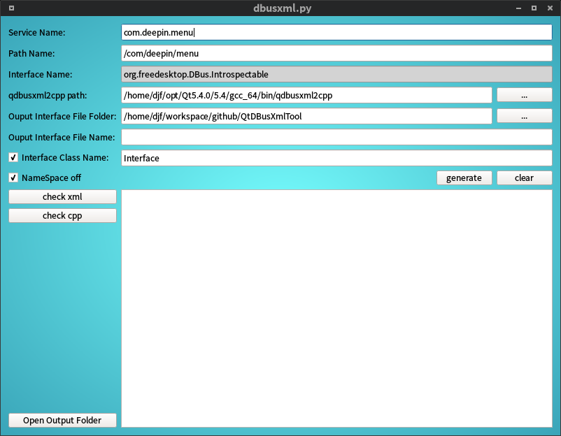

# QtDBusXmlTool

#### enviroment 
+ python2.7
+ PyQt5

#### run

	python dbusxml.py

#### result

You will get a **xxx_interface.h** in current folder! 
Copy to your Qt pro folder and add to project.